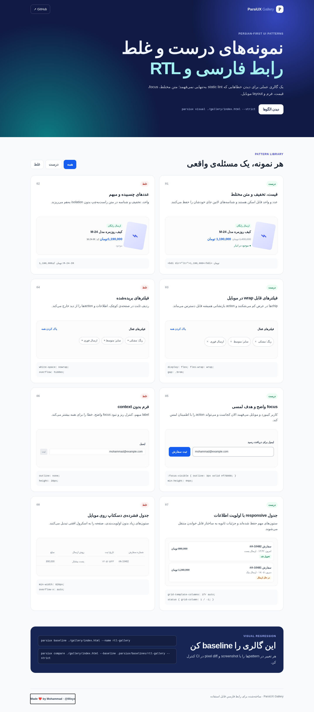

# ParsiUX

**موتور تصمیم‌یار UI/UX فارسی، RTL Quality Gate و ابزار Visual Regression برای AI coding assistantها**

ParsiUX به‌جای ترجمه‌ی سطحی یک design system انگلیسی، برای ساخت و کنترل کیفیت رابط فارسی طراحی شده است: از انتخاب الگوی محصول و فونت تا تولید token، پیدا کردن ایراد RTL، screenshot واقعی و جلوگیری از regression پیش از merge.

> مناسب Next.js، React، Tailwind CSS و shadcn/ui. قابل استفاده کنار Claude Code، Cursor و Agentهای استاندارد.

## چه کاری انجام می‌دهد؟

- جست‌وجوی الگوهای طراحی با عبارت فارسی، انگلیسی و شکل‌های رایج نوشتن آن‌ها
- پیشنهاد ساختار، رنگ، تایپوگرافی، کامپوننت و anti-pattern برای محصول‌های مختلف
- تولید `MASTER.fa.md` و `tokens.json` برای هر پروژه
- بررسی خودکار RTL: جهت صفحه، زبان، فونت فارسی، propertyهای منطقی CSS، کلاس‌های فیزیکی Tailwind و خطرهای overflow
- Visual Audit و Visual Regression با Playwright، screenshot و pixel diff
- Guardian Quality Gate برای اجرای یکپارچه‌ی static audit، runtime audit، profile فارسی و baseline در CI
- rule packهای قابل انتخاب برای رابط پایه، فروشگاه، فین‌تک، رزرو، داشبورد و سلامت
- راهنمای عملی برای متن مختلط، مبلغ، شماره، URL، دسترس‌پذیری و responsive text

## نصب

تا زمان انتشار نخستین نسخه در npm، پروژه را مستقیم از GitHub نصب کن:

```bash
git clone https://github.com/mamadiezad/parsiux.git
cd parsiux
npm install
npm run build
npm link
parsiux --help
```

برای استفاده بدون نصب global هم می‌توانی از `node dist/src/cli.js` استفاده کنی. Node.js 20 یا جدیدتر لازم است.

## شروع سریع

### نصب skill برای agent

```bash
parsiux init --ai claude --target .
parsiux init --ai cursor --target .
parsiux init --ai all --target .
```

### پیدا کردن الگوی مناسب

```bash
parsiux search "فروشگاه اینترنتی پوشاک با پرداخت آنلاین"
parsiux search "appointment booking calendar"
```

### ساخت design system فارسی

```bash
parsiux design "فروشگاه اینترنتی پوشاک با ارسال و پرداخت آنلاین" \
  --stack nextjs \
  --name "فروشگاه پوشاک" \
  --output .
```

خروجی در مسیر زیر ساخته می‌شود:

```text
design-system/فروشگاه-پوشاک/
├── MASTER.fa.md
└── tokens.json
```

### بررسی static RTL پروژه

```bash
parsiux audit .
parsiux audit . --strict
parsiux audit . --json
```

حالت `--strict` در صورت وجود error یا warning با exit code غیر صفر تمام می‌شود و برای CI مناسب است.

### Visual RTL Audit با screenshot واقعی

Visual Audit صفحه را در مرورگر Chromium و سه viewport موبایل، تبلت و دسکتاپ باز می‌کند، screenshot می‌گیرد و وضعیت واقعی layout را بررسی می‌کند.

```bash
npx playwright install chromium
parsiux visual http://localhost:3000 --output ./parsiux-visual-report
```

روی Linux اگر Chromium به‌خاطر libraryهای سیستم اجرا نشد، یک‌بار این دستور را اجرا کن:

```bash
npx playwright install --with-deps chromium
```

برای بررسی یک فایل HTML محلی:

```bash
parsiux visual ./preview/index.html --viewports 375,768,1440 --strict
```

خروجی شامل `report.fa.md`، `report.json` و screenshot هر viewport است. دستور visual مواردی مثل scroll افقی واقعی، جهت و زبان سند، فونت فارسی، هدف‌های لمسی کوچک، focus نامرئی، متن مختلط bidi و کنتراست مشکوک را گزارش می‌دهد.

### Baseline و Visual Regression

وقتی یک صفحه از نظر طراحی تأیید شد، از آن baseline بگیر:

```bash
parsiux baseline http://localhost:3000 \
  --name homepage \
  --output .parsiux/baselines
```

در CI یا پیش از merge، نسخه‌ی جدید را با baseline مقایسه کن:

```bash
parsiux compare http://localhost:3000 \
  --baseline .parsiux/baselines/homepage \
  --output ./parsiux-regression-report \
  --max-diff 0.01 \
  --strict
```

`max-diff` نسبت پیکسل‌های تغییرکرده است؛ مقدار پیش‌فرض `0.01` یعنی ۱٪. گزارش compare تصویر فعلی، تصویر diff، نسبت تغییر هر viewport و نتیجه‌ی PASS یا FAIL را می‌سازد. برای جایگزین کردن baseline از `--force` استفاده کن.

## ParsiUX Guardian

Guardian لایه‌ی نهایی کنترل کیفیت است. یک گزارش واحد می‌سازد و static RTL audit، Persian readiness rules، Visual Audit و در صورت وجود baseline، Visual Regression را کنار هم اجرا می‌کند.

```bash
parsiux init --ci --target .
```

این دستور دو فایل می‌سازد:

```text
parsiux.config.json
.github/workflows/parsiux-guardian.yml
```

نمونه‌ی config تولیدشده:

```json
{
  "profile": "base-fa",
  "staticTarget": ".",
  "visualTarget": "http://localhost:3000",
  "baseline": ".parsiux/baselines/homepage",
  "output": "parsiux-gate-report",
  "maxDifference": 0.01
}
```

بعد از آماده‌بودن dev server:

```bash
parsiux gate --config parsiux.config.json --strict
```

در GitHub Actions از `--github` استفاده کن تا warning و errorها به annotation تبدیل شوند و summary فارسی در صفحه‌ی اجرای Action نوشته شود:

```bash
parsiux gate --config parsiux.config.json --github --strict
```

workflow تولیدشده برای استفاده‌ی بدون npm publish، نسخه‌ی اصلی ParsiUX را clone می‌کند، پروژه را روی پورت 3000 منتظر می‌ماند، Chromium را نصب می‌کند و artifactهای `parsiux-gate-report` را نگه می‌دارد. اگر start command یا پورت پروژه متفاوت است، همان دو خط workflow و `visualTarget` را متناسب با پروژه تغییر بده.

### Rule Packها

```bash
parsiux profiles
```

| Profile | کاربرد |
| --- | --- |
| `base-fa` | RTL، متن فارسی، bidi، فونت و logical CSS |
| `ecommerce-fa` | قیمت، تومان/ریال، خرید، موجودی و checkout |
| `fintech-fa` | مبلغ، شناسه، داده‌ی حساس و isolation متن LTR |
| `booking-fa` | فرم، زمان، ظرفیت و مسیر رزرو |
| `dashboard-fa` | جدول، KPI، فیلتر و نمایش داده در RTL |
| `healthcare-fa` | فرم حساس، consent و محتوای حریم خصوصی |

### اصلاح امن RTL

```bash
parsiux fix .
parsiux fix . --apply
```

حالت عادی فقط dry-run است. `--apply` صرفاً تبدیل‌های کم‌خطر مانند `margin-left` به `margin-inline-start`، `text-align: left` به `text-align: start` و کلاس‌های Tailwind مثل `ml-*` به `ms-*` را اعمال می‌کند. propertyهای موقعیت‌دهی مثل `left/right` عمداً خودکار تغییر نمی‌کنند، چون ممکن است قصد طراحی را عوض کنند.

## RTL Gallery

مسیر [gallery/](gallery/) یک گالری فارسی و بدون وابستگی بیرونی است که نمونه‌های درست و غلط RTL را کنار هم نشان می‌دهد: مبلغ و bidi، filter chipهای موبایل، focus و target لمسی، فرم، order list و جدول responsive.



```bash
parsiux visual ./gallery/index.html --strict
parsiux baseline ./gallery/index.html --name rtl-gallery
parsiux compare ./gallery/index.html --baseline .parsiux/baselines/rtl-gallery --strict
```

نمونه‌های «غلط» داخل گالری عمداً با `data-parsiux-ignore` از runtime audit کنار گذاشته شده‌اند تا خود گالری بتواند baseline سالم داشته باشد؛ آن‌ها برای مقایسه‌ی دیداری و آموزش هستند، نه الگوی پیاده‌سازی.

## نمونه‌ی خروجی Audit

ParsiUX مواردی مثل این‌ها را پیدا می‌کند:

- نبودن `lang="fa"` یا `dir="rtl"`
- استفاده از `margin-left`، `right` و `text-align: left`
- کلاس‌های `ml-*`، `mr-*`، `pl-*`، `pr-*`، `left-*` و `text-left` در Tailwind
- نبودن فونت فارسی شناخته‌شده
- نبودن viewport موبایل
- `overflow: hidden`هایی که احتمال پنهان کردن متن فارسی یا focus دارند

این ابزار جای بازبینی انسانی و screenshot test را نمی‌گیرد؛ اما خطاهای پرتکرار RTL را خیلی زود به تیم نشان می‌دهد.

## قرارداد RTL پیشنهادی

```html
<html lang="fa" dir="rtl">
```

```css
.card {
  margin-inline: auto;
  padding-inline: 1rem;
  inset-inline-start: 0;
  text-align: start;
}
```

برای عدد، لینک، شماره کارت، کد و شناسه‌هایی که باید LTR بمانند، context را صریح تعریف کن و در متن فارسی آن‌ها را isolate نگه دار.

## پوشش اولیه‌ی دانش محصول

- فروشگاه اینترنتی و checkout
- پرداخت و فین‌تک
- رزرو و نوبت‌دهی
- SaaS و پنل سازمانی
- داشبورد تحلیلی
- آموزش آنلاین
- سلامت و کلینیک
- آگهی و مارکت‌پلیس

این دیتاست عمداً کوچک اما قابل بررسی شروع شده است. هر entry باید problem، goal، component، copy rule، anti-pattern و audit hint مشخص داشته باشد؛ فقط اضافه‌کردن لیست رنگ یا اسم یک UI style کافی نیست.

## Docker

image پروژه Chromium لازم برای Visual Audit را هم دارد:

```bash
docker build -t parsiux .
docker run --rm -v "$PWD:/workspace" parsiux audit /workspace
docker run --rm -v "$PWD:/workspace" parsiux visual /workspace/preview/index.html --output /workspace/parsiux-visual-report
```

برای audit یک dev server از داخل Docker، URL قابل دسترس از کانتینر را بده؛ مثلاً روی macOS و Windows معمولاً `http://host.docker.internal:3000`.

## توسعه

```bash
npm install
npm run verify
```

پروژه با TypeScript، Playwright، pixelmatch و PNG diff ساخته شده است. تست‌ها نرمال‌سازی فارسی، relevance جست‌وجو، تولید token، rule packها، safe fix، RTL audit و regression report را پوشش می‌دهند.

## مسیر توسعه

- reusable GitHub Action برای نصب بدون clone در پروژه‌های دیگر
- rule packهای عمیق‌تر برای پرداخت، فروشگاه، محتوای فارسی و فرم‌های محلی
- adapterهای Nuxt، Flutter و React Native
- galleryهای contribution-ready برای کامپوننت‌های بیشتر
- corpus عمومی برای سنجش کیفیت جست‌وجوی فارسی

## ریشه و شفافیت

ParsiUX یک پیاده‌سازی مستقل است که از ایده و مسئله‌ای که [UI UX Pro Max](https://github.com/nextlevelbuilder/ui-ux-pro-max-skill) مطرح کرده الهام گرفته است. هیچ کد منبع، دیتاست یا asset آن پروژه در این ریپو کپی نشده و ParsiUX وابسته یا محصول رسمی آن‌ها نیست. جزئیات در [NOTICE.md](NOTICE.md) آمده است.

---

Made ❤️ by [Mohammad](https://t.me/llllxyz) · [@llllxyz](https://t.me/llllxyz)
